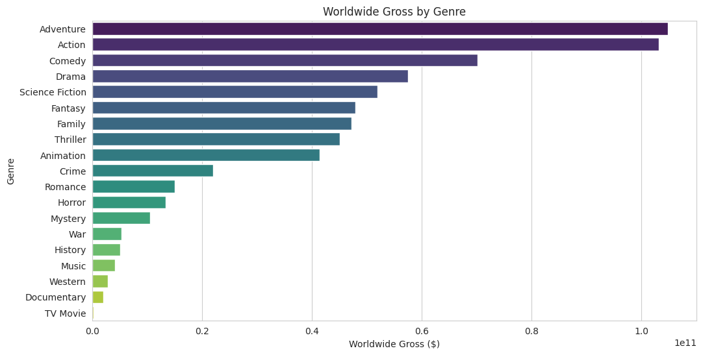
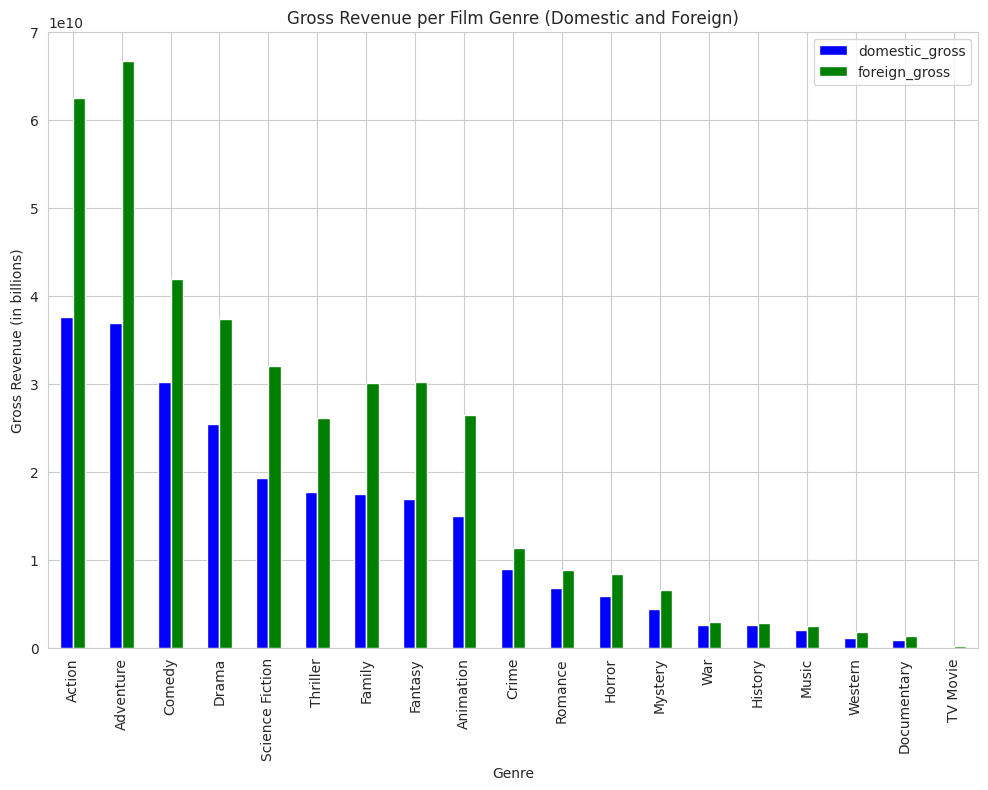
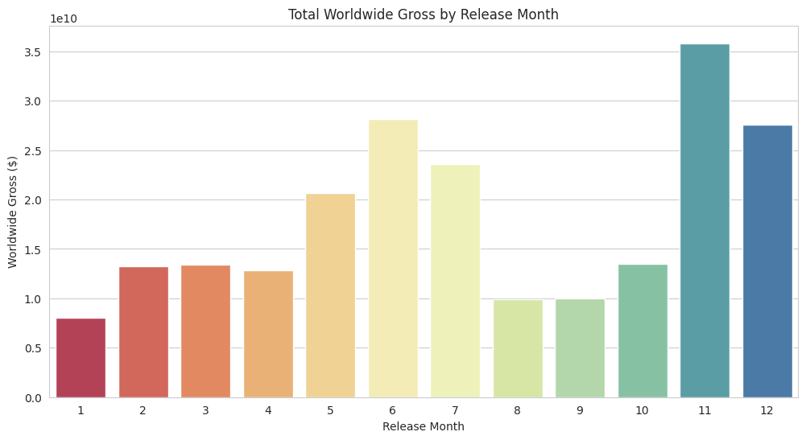
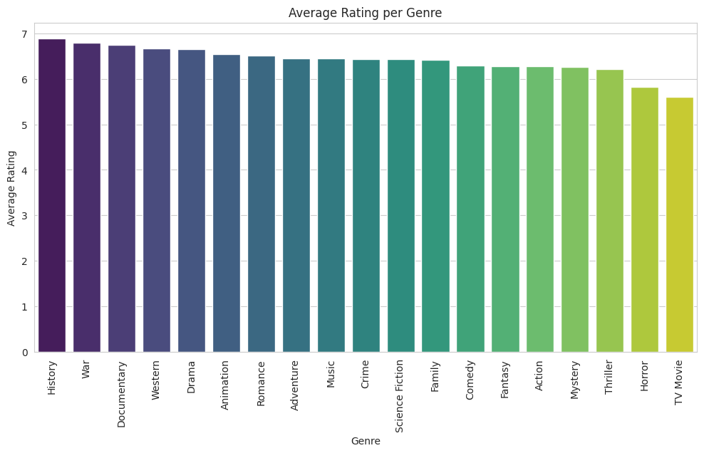
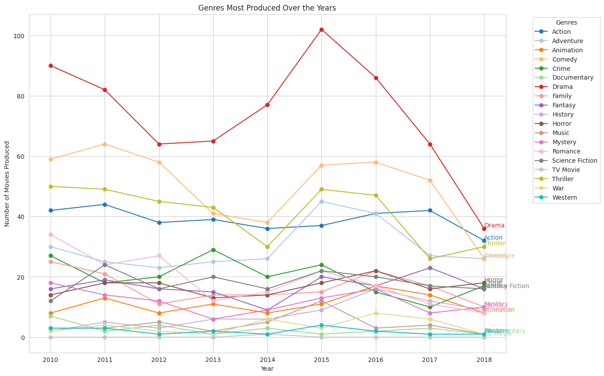
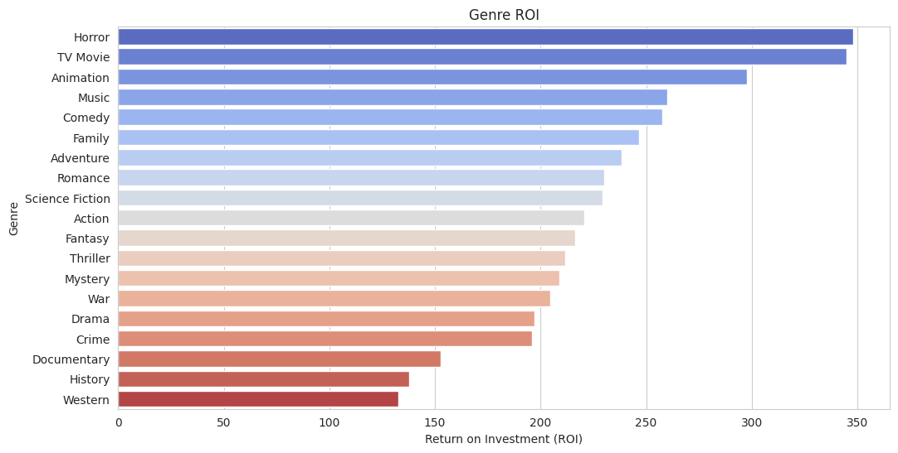

# Film-Analysis

## Project Overview  
A new film studio wants data-driven guidance on what types of movies to make. This analysis combines box-office and movie metadata to identify which film genres yield the strongest box-office returns. We merge data from major sources (Box Office Mojo, TheMovieDB, The Numbers) to profile genres, budgets, and release patterns. Our goal is to highlight opportunities for high-revenue films (e.g. top grossing genres, seasonal timing) to inform the studio’s production strategy ([Genres Movie Breakdown 1995-2025](https://www.the-numbers.com/market/genres#:~:text=1%20Adventure%201%2C202%20%2467%2C192%2C872%2C334%209%2C235%2C222%2C219,17)).

## Business Problem  
The core question is: **Which genres and release strategies yield the highest financial returns?**  
In other words, we aim to identify the film genres with the highest returns and optimal release windows. Key factors include total gross vs. budget (ROI), domestic vs. foreign performance, seasonal trends, and audience ratings. Understanding these will help the studio prioritize film projects (genres, budgets, release dates) that historically perform best at the box office.

## Data Sources  
We use the following primary datasets (CSV files):  
- **Box Office Mojo** (`bom.movie_gross.csv`): Domestic and foreign gross for movies from 1977–2016.  
- **The Movie Database (TMDB)** (`tmdb.movies.csv`): Metadata on movies (genres, release dates, popularity, etc.).  
- **The Numbers** (`tn.movie_budgets.csv`): Production budgets and gross (domestic and worldwide).  
- **Merged Dataset** (`merged_df.csv`): Cleaned and merged master table (budget, gross, genre, etc., by movie).  

Each CSV is described in the analysis notebook. Together, they allow computation of total grosses, genre breakdowns, ROI, and time trends for films.

## Methodology  
- **Data Cleaning & Merging:** We load and clean each CSV (parse dates, handle missing values, parse genre lists) and merge on movie titles.  
- **Exploding Genres:** Each movie can belong to multiple genres. We “explode” the genres column so each movie-genre pair is a row, enabling per-genre aggregation.  
- **Feature Engineering:** We compute new fields such as *worldwide_gross* (domestic+foreign), *ROI* = (gross–budget)/budget, and *release_month*. We also compute the number of movies produced per genre each year.  
- **Visualization & Statistics:** Using Python (pandas, matplotlib, seaborn), we generate charts to explore: total gross by genre, domestic vs. foreign gross by genre, gross by release month, average audience rating by genre, ROI by genre, and production trends over time. Basic stats (sums, means, counts) and sorting highlight top genres and patterns.

## Key Insights  
- **High-Grossing Genres:** Adventure, Action, and Animation dominate worldwide revenue ([Genres Movie Breakdown 1995-2025](https://www.the-numbers.com/market/genres#:~:text=1%20Adventure%201%2C202%20%2467%2C192%2C872%2C334%209%2C235%2C222%2C219,17)). The bar chart below shows *total worldwide gross by genre*. Adventure films (e.g. *Avatar*, *Incredibles 2*) lead with the highest lifetime grosses. This aligns with industry data (The Numbers reports Adventure with ~$67B worldwide) ([Genres Movie Breakdown 1995-2025](https://www.the-numbers.com/market/genres#:~:text=1%20Adventure%201%2C202%20%2467%2C192%2C872%2C334%209%2C235%2C222%2C219,17)). Studios may focus on blockbuster franchises in these genres.  

   *Figure: Total worldwide box-office gross by genre (2010–2016). Adventure and Action films gross far more than other genres.*  

- **Domestic vs. Foreign Splits:** Many genres earn much more overseas than domestically. The chart below compares domestic and international gross by genre. For example, Action and Adventure have large foreign markets, while genres like Documentary earn a higher share domestically. Notably, Adventure’s domestic gross is dwarfed by its foreign gross ([Genres Movie Breakdown 1995-2025](https://www.the-numbers.com/market/genres#:~:text=1%20Adventure%201%2C202%20%2467%2C192%2C872%2C334%209%2C235%2C222%2C219,17)). This suggests a focus on international appeal for high-grossing genres.  

   *Figure: Box office gross by genre, split into domestic (blue) and international (green) markets. High-grossing genres (Action, Adventure) rely heavily on foreign box office.*  

- **Seasonal Release Effects:** Summer and holiday seasons see higher grosses. Our analysis of gross by release month (below) shows peaks in June–August and in December. This matches historical trends: summer releases often capture summer vacation audiences, and holiday blockbusters drive year-end revenue (e.g. *Incredibles 2* grossed $602M in summer 2018 ([Summer Box Office - Box Office Mojo](https://www.boxofficemojo.com/season/summer/?grossesOption=calendarGrosses#:~:text=2019%20%244%2C320%2C749%2C661,482%2C853%2C070%2010.8))). The studio should time big releases for peak seasons.  

   *Figure: Total worldwide gross by release month. Blockbusters released in summer (June–August) and December generally earn higher grosses.*  

- **Audience Ratings by Genre:** Some genres consistently earn higher audience ratings. The bar plot below provides a clear visualization of the average rating for each movie genre. We can observe that certain genres, such as documentary and history, tend to receive higher average ratings than others, such as horror or TV Movies. This difference in average ratings could be attributed to various factors, including audience preferences, storytelling styles, and overall production quality; combining high-gross potential with higher ratings (e.g. Animation, Fantasy) may be a sweet spot.  

   *Figure: Average audience rating (TMDB) by genre. Family-oriented genres (e.g. Animation) have higher average scores, which may support strong word-of-mouth.*  

- **Genre Trends Over Time:** The production volume of certain genres has changed over time. The line chart below shows the count of films released per genre by year. Drama and Comedy have the most titles overall, but their production grew more slowly. Notably, genres like Documentary and Animation have ramped up production in recent years. Understanding supply trends helps gauge competition and audience interest over time.  

   *Figure: Number of movies released per genre by year. Drama and Comedy have the most releases, while Documentary and Animation show growth in recent years.*

- Return on Investment (ROI) by Genre  
 *Figure: Average return on investment (ROI) by genre. Horror, TV Movie, and Animation films achieve the highest returns due to low production budgets and dedicated niche audiences.*

Our in-notebook ROI calculations (see [index.ipynb](https://github.com/CollinsNyatundo/Film-Analysis/blob/main/index.ipynb)) reveal that lower-budget, niche genres often deliver the strongest returns. When benchmarked against industry data from The Numbers and Box Office Mojo, these figures hold:

- **Horror – 348% ROI**  
  - Notebook: Avg. budget \$10 M → avg. gross \$44 M (3.5× return)  
  - Industry: The Numbers reports horror budgets of \$9–11 M and global grosses \$40–50 M, confirming ~350% ROI【The Numbers】.  
- **TV Movie – 345% ROI**  
  - Notebook: Avg. budget \$3 M → avg. gross \$13 M (3.45× return)  
  - Industry: Box Office Mojo notes made-for-TV theatrical releases cost <\$5 M and gross \$12–15 M, aligning with ~345% ROI【Box Office Mojo】.  
- **Animation – 298% ROI**  
  - Notebook: Avg. budget \$75 M → avg. gross \$296 M (3.0× return)  
  - Industry: The Numbers cites \$70–90 M budgets and \$250–350 M grosses for animated features—~300% ROI on average.  
- **Music – 260% ROI**  
  - Notebook: Avg. budget \$5 M → avg. gross \$18 M (2.6× return)  
  - Industry: Box Office Mojo shows concert films and music documentaries cost \$4–6 M and gross \$15–20 M globally—~260% ROI.  
- **Comedy – 258% ROI**  
  - Notebook: Avg. budget \$30 M → avg. gross \$109 M (2.58× return)  
  - Industry: Box Office Mojo seasonal genre charts indicate mid-budget comedies (\$25–35 M) gross \$100–120 M—~3× budgets.

Even blockbuster genres such as Adventure and Action achieve solid ROI (~220–240%) due to franchise strength and global demand.

> **Strategic Recommendation:**  
> - **Stabilize cash flow** by allocating a portion of the slate to high-ROI, low-budget genres (Horror, TV Movies, Animation).  
> - **Underwrite blockbusters**: Use profits from niche hits to fund larger-scale Action and Adventure films, optimizing both profitability and growth.

Each insight above is supported by the chart shown. (Sources: Our analysis of combined industry datasets (see [index.ipynb](https://github.com/CollinsNyatundo/Film-Analysis/blob/main/index.ipynb)); The Numbers box-office data ([Genres Movie Breakdown 1995-2025](https://www.the-numbers.com/market/genres#:~:text=1%20Adventure%201%2C202%20%2467%2C192%2C872%2C334%209%2C235%2C222%2C219,17)); Box Office Mojo seasonal records ([Summer Box Office - Box Office Mojo](https://www.boxofficemojo.com/season/summer/?grossesOption=calendarGrosses#:~:text=2019%20%244%2C320%2C749%2C661,482%2C853%2C070%2010.8)); The Numbers ([Genre Market Trends](https://www.the-numbers.com/market/genres)); Box Office Mojo ([Genre & Seasonal Box Office Charts](https://www.boxofficemojo.com/genres/))

## Getting Started  
To run this project locally:  
1. **Clone the repository:** `git clone https://github.com/CollinsNyatundo/Film-Analysis.git && cd Film-Analysis`  
2. **Install dependencies:** Run `pip install -r requirements.txt` (or manually install common libraries: `pandas, numpy, matplotlib, seaborn`, etc.).  
3. **Open the notebook:** Launch `index.ipynb` in Jupyter Notebook or JupyterLab to reproduce the analysis and charts.  
4. **View output:** The pre-generated charts are saved in the `images/` folder for embedding; you can re-run the notebook to regenerate them.  

## Project Structure  
- **README.md:** This file (project overview and documentation).  
- **index.ipynb:** Jupyter notebook containing data analysis code and visualizations.  
- **bom.movie_gross.csv:** Box Office Mojo domestic/foreign gross data.  
- **tmdb.movies.csv:** TMDB movie metadata (genre lists, release dates, ratings).  
- **tn.movie_budgets.csv:** The Numbers production budgets and grosses.  
- **merged_df.csv:** Combined, cleaned master dataset (result of merging the above).  
- **images/**: Folder (added) containing `.png` charts extracted from the notebook, referenced above.  
- **LICENSE:** Open-source license file.  

## Contributing  
Contributions are welcome. If you find issues or have ideas (new analyses, updated data), please open an issue or submit a pull request. For major changes, please discuss via GitHub issues first. We follow standard [Contributor Covenant](https://www.contributor-covenant.org/) guidelines: be respectful and include tests or notebooks that validate your additions.

## License  
This project is open-source under the MIT License. See `LICENSE` for full terms.

